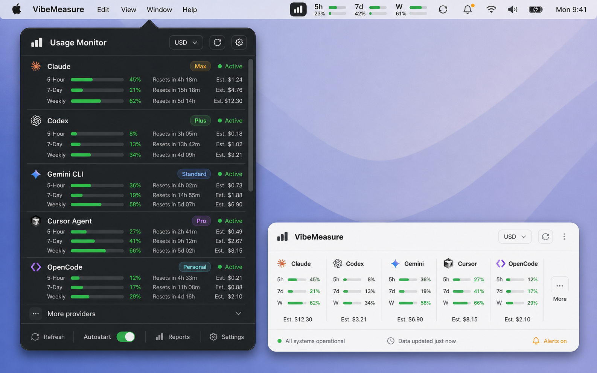

# VibeMeasure

VibeMeasure is a native desktop usage monitor for LLM coding tools. It is designed to show how many tokens have been used, which reset windows are active, which values are verified, and which values still need manual setup.



## Current Status

This repository is the initial native implementation branch. It includes:

- A shared Rust core with the required provider catalog, source metadata, usage windows, SQLite persistence, report export, ECB currency-rate parsing, and a Codex CLI JSONL adapter.
- A CLI for initializing the database, importing Codex token events, creating snapshots, refreshing ECB rates, and exporting reports.
- Native starter shells for macOS, Windows, GNOME, and KDE.
- English documentation, Mermaid diagrams, and mockup assets.

The project does **not** hardcode unverified model names, tariffs, provider quotas, API endpoints, or reset policies. Unknown values remain unknown until a verified local adapter, official API integration, official documentation source, or manual user entry provides them.

## Supported Tools Catalog

All required tools are present in the catalog:

- Claude Code (`claude`)
- Codex CLI (`codex`)
- Devin for Terminal
- Gemini CLI (`gemini`)
- OpenCode (`opencode`)
- Hermes
- Kimi CLI
- Cursor Agent (`cursor-agent`)
- Qwen Code
- Qoder CLI
- GitHub Copilot CLI
- Pi
- Kiro CLI
- Kilo
- Mistral Vibe CLI
- DeepSeek TUI
- MiniMAX

Only Codex CLI has an implemented local parser in this initial slice because local `token_count` events were verified. Other providers remain manual or adapter-pending until their data source is proven.

On macOS, an enabled Codex provider with data source `Local adapter` reads the latest local Codex CLI `token_count` events from `~/.codex/sessions` when the popover opens or the user clicks Refresh.

## Display Modes

The default first-run view is `Provider cycles`, but all built-in LLM providers are disabled for the menu-bar popover and widget until the user explicitly enables them in Settings.

- `Provider cycles`: each enabled provider shows its own verified or manually configured windows, such as 5-hour, weekly, or monthly cycles.
- `5 hours`: compares all providers across the last 5 hours.
- `1 week`: compares all providers across the current UTC week.
- `1 month`: compares all providers across the current UTC calendar month.

If a provider's limit, reset time, tariff, or model name is not verified, VibeMeasure shows a manual setup state instead of guessing.

## Quick Start

```bash
cargo test
cargo run -p vibemeasure-cli -- catalog
cargo run -p vibemeasure-cli -- init-db --db vibemeasure.sqlite
cargo run -p vibemeasure-cli -- import-codex \
  --db vibemeasure.sqlite \
  --jsonl tests/fixtures/codex/token_count.jsonl
cargo run -p vibemeasure-cli -- snapshot --db vibemeasure.sqlite --mode provider-cycles
cargo run -p vibemeasure-cli -- report \
  --db vibemeasure.sqlite \
  --start 2026-06-01T00:00:00Z \
  --end 2026-06-02T00:00:00Z \
  --currency USD \
  --xlsx report.xlsx \
  --pdf report.pdf
```

## Native Platform Validation

macOS:

```bash
cd platforms/macos
swift build
swift run VibeMeasureMac
```

Windows:

```powershell
cd platforms/windows/VibeMeasure.Windows
dotnet restore
dotnet build
dotnet run
```

Linux:

```bash
gnome-extensions pack platforms/linux/gnome/vibemeasure@chardonnay.example
kpackagetool6 --type Plasma/Applet --install platforms/linux/kde/org.vibemeasure.plasmoid
```

## Documentation

- [Architecture](docs/architecture.md)
- [Adapter Guide](docs/adapter-guide.md)
- [Data Model](docs/data-model.md)
- [Pricing And Currency](docs/pricing-currency.md)
- [OS Integration](docs/os-integration.md)
- [Widgets](docs/widgets.md)
- [Reporting And Export](docs/reporting-export.md)
- [Validation](docs/validation.md)

## License

VibeMeasure is released under the [MIT License](LICENSE).
