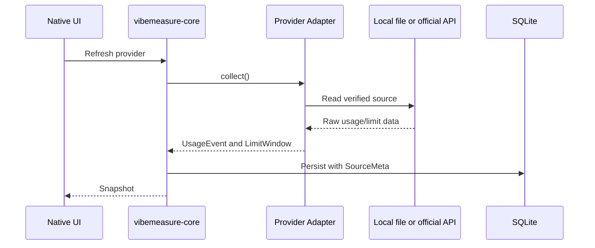

# Adapter Guide

Provider adapters translate verified source data into shared core records.

## Initial Adapter State

Implemented:

- `codex`: parses verified local Codex CLI `token_count` JSONL events.

macOS UI status:

- If the Codex provider is enabled and set to `Local adapter`, the menu-bar popover reads `~/.codex/sessions` directly and displays the latest verified 5-hour/weekly windows from Codex CLI `token_count` events.
- If no `token_count` event exists yet, the popover shows a data issue instead of guessing.

Cataloged but not yet parsed:

- Claude Code, Devin for Terminal, Gemini CLI, OpenCode, Hermes, Kimi CLI, Cursor Agent, Qwen Code, Qoder CLI, GitHub Copilot CLI, Pi, Kiro CLI, Kilo, Mistral Vibe CLI, DeepSeek TUI, MiniMAX.

These remain manual or adapter-pending until a local format or official API is verified.

## Test Double Rule

Mocks and fakes are only allowed in test code and must be clearly marked as test doubles. Sanitized fixtures live under `tests/fixtures/`.

## Adding An Adapter

1. Verify the source format from local evidence or official documentation.
2. Add a parser that returns `UsageEvent` and optional `LimitWindow` values.
3. Preserve source metadata for every emitted value.
4. Add sanitized fixtures and parser tests.
5. Update docs with exactly what is verified and what remains manual.
