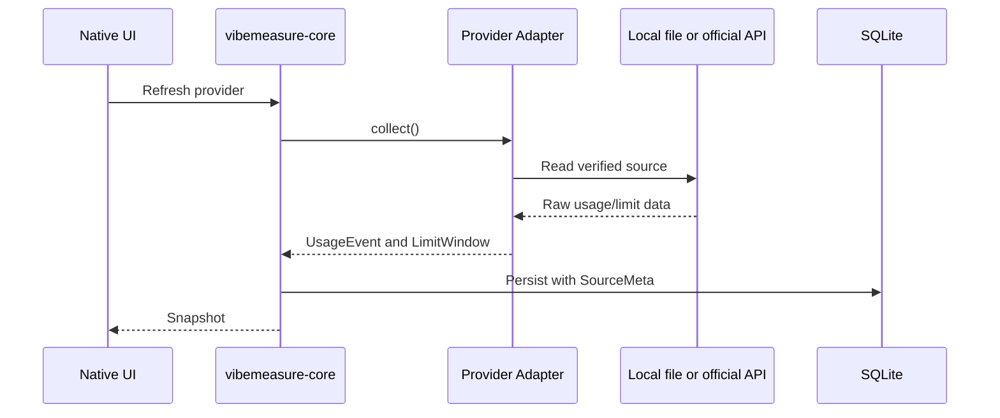

# Adapter Guide

Provider adapters translate verified source data into shared core records.

## Initial Adapter State

Implemented:

- `claude`: scans local Claude Code data for verified `rate_limits` / `rateLimits` statusline payloads and maps any discovered 5-hour, 7-day, or monthly windows. If no such local payload exists, no usage is shown.
- `codex`: parses verified local Codex CLI `token_count` JSONL events.
- `gemini`: parses local Gemini CLI chat session token totals from `~/.gemini/tmp/**/chats/*.json*`. This is usage-only because the verified local files observed during validation contain token totals and model names, but not quota/reset windows.
- `minimax`: runs the official MiniMax CLI command `mmx quota show --output json` and maps the returned current-interval and weekly quota values into live windows.

macOS UI status:

- If the Claude Code provider is enabled and set to `Local adapter`, the macOS app reads local Claude Code JSON/JSONL data on the provider's configured pull interval and displays verified rate-limit windows only when a `rate_limits` or `rateLimits` payload is present. On the validation machine, `claude auth status` reported that Claude Code was not logged in and no local rate-limit payload was found, so the app correctly shows a data issue instead of guessing.
- If the Codex provider is enabled and set to `Local adapter`, the macOS app reads `~/.codex/sessions` directly on the provider's configured pull interval and displays the latest verified 5-hour/weekly windows from Codex CLI `token_count` events.
- If the Gemini CLI provider is enabled and set to `Local adapter`, the macOS app reads Gemini CLI chat session files directly on the provider's configured pull interval and displays the latest model name plus token total. The local Gemini CLI files observed during validation do not contain an active plan name, quota, cost, or reset window, so those values remain manual/unknown.
- If the MiniMAX provider is enabled and set to `Local adapter`, the macOS app runs `mmx quota show --output json` on the provider's configured pull interval and displays the current-interval and weekly windows reported by the CLI. MiniMAX shows `Token Plan` as the verified plan family because the quota command reports Token Plan usage but does not expose the exact active tier name; users can override the plan name manually.
- The default pull interval is 5 minutes and can be changed per provider in Settings.
- If no `token_count` event exists yet, the popover shows a data issue instead of guessing.
- If no Claude Code rate-limit payload or Gemini CLI token event exists yet, the popover shows a data issue instead of guessing.
- If `mmx` is not installed, not authenticated, or returns a non-success response, the popover shows a data issue instead of guessing.

Cataloged but manual/no-adapter until a verified source exists:

- Devin for Terminal, OpenCode, Hermes, Kimi CLI, Cursor Agent, Qwen Code, Qoder CLI, GitHub Copilot CLI, Pi, Kiro CLI, Kilo, Mistral Vibe CLI, DeepSeek TUI.

These remain manual or adapter-pending until a local format or official API is verified.

Local validation on 2026-06-02 found only these provider commands installed in the development environment: `claude`, `codex`, `gemini`, `opencode`, `cursor-agent`, and `mmx`. `opencode --help` failed before producing usage data because the CLI could not create its state directory. The other required provider commands were not present in `PATH`, and no official local usage command or documented local quota schema was available in this repository context. The app must therefore keep those providers manual rather than invent endpoints or schemas.

Cursor Agent note: this provider refers to Anysphere/Cursor's `cursor-agent` CLI documented at `docs.cursor.com` and distributed through Cursor's official `cursor.com` product surface. The local `~/.cursor/ai-tracking/ai-code-tracking.db` schema observed during validation contains AI-code tracking tables, not current token or quota usage. The Cursor CLI help and official CLI docs do not currently document a local quota command or plan-name output. Cursor remains manual/no-adapter until a verified source is available; users can store the active plan name manually in provider settings.

## Test Double Rule

Mocks and fakes are only allowed in test code and must be clearly marked as test doubles. Sanitized fixtures live under `tests/fixtures/`.

## Adding An Adapter

1. Verify the source format from local evidence or official documentation.
2. Add a parser that returns `UsageEvent` and optional `LimitWindow` values.
3. Preserve source metadata for every emitted value.
4. Add sanitized fixtures and parser tests.
5. Update docs with exactly what is verified and what remains manual.
