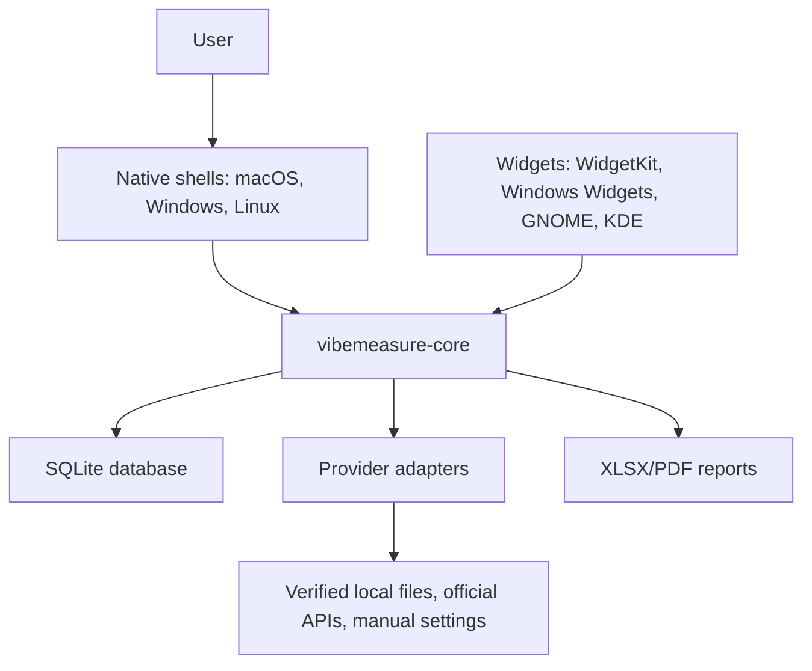

# Architecture

VibeMeasure uses a shared core plus thin native shells.

## Responsibilities

- Native shells own OS-specific presentation, notifications, autostart, and widget packaging.
- `vibemeasure-core` owns provider catalog data, source metadata, usage windows, persistence, snapshots, reports, and verified parsers.
- Provider adapters may read local logs or official APIs only when the format is verified.
- Manual settings are first-class data with `manual` source status, not hidden defaults.

## Truth Policy

Every usage, pricing, limit, model, currency, and reset-window value must carry:

- `source.kind`: local evidence, official API, official docs, manual, unknown, or test double.
- `source.status`: verified, estimated, manual, or unknown.
- `source.label`: human-readable origin.
- `source.fetched_at`: timestamp.

VibeMeasure must show unknown/manual state rather than invent a tariff, quota, schema, or reset window.

