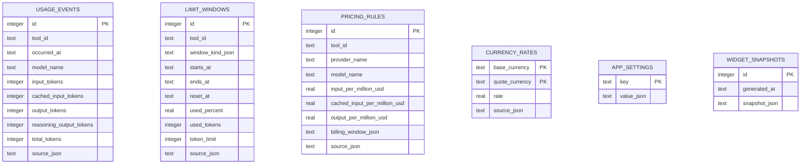

# Data Model

The shared core stores data in SQLite.

## Display Modes

- `provider_cycles`
- `five_hours`
- `one_week`
- `one_month`

Provider cycles are the default display mode. Built-in LLM providers are disabled in menu-bar and widget surfaces until the user explicitly enables them. The period comparison modes are derived from stored events and do not imply provider-specific limits unless a limit window is verified or manually configured.

## Window Kinds

- `five_hours`
- `one_week`
- `one_month`
- `custom_minutes`

Unknown provider windows are not generated automatically.
