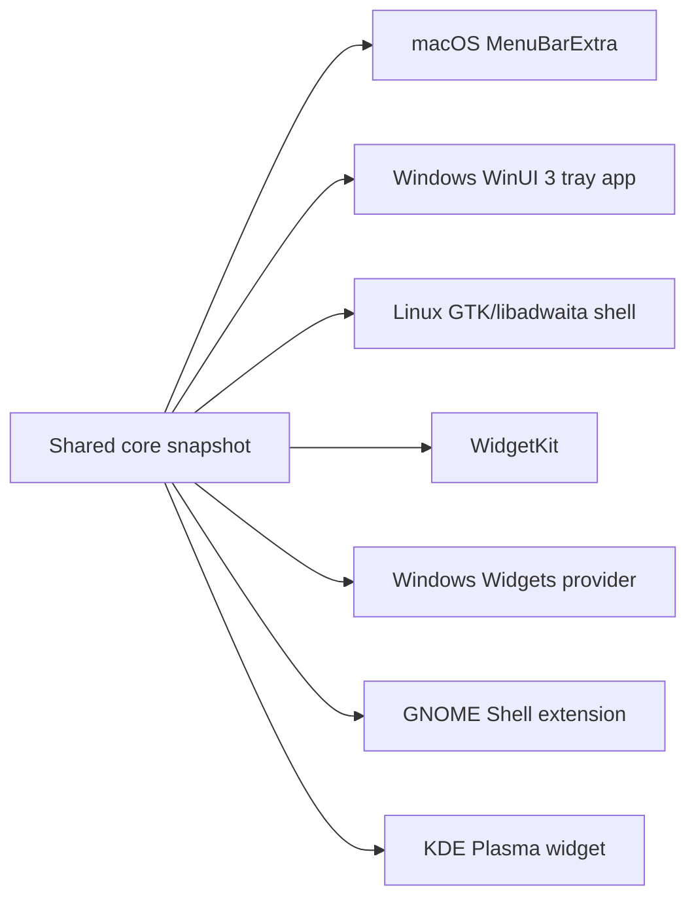

# OS Integration

## macOS

The first shell uses SwiftUI `MenuBarExtra`. WidgetKit source is present and must be attached to an Xcode widget extension target for packaging.

Official references:

- <https://developer.apple.com/documentation/swiftui/menubarextra>
- <https://developer.apple.com/documentation/widgetkit>

## Windows

The first shell uses WinUI 3, .NET 10 LTS, and Windows App SDK. Windows Widgets require a packaged provider model.

Official reference:

- <https://learn.microsoft.com/en-us/dotnet/core/releases-and-support>
- <https://www.nuget.org/packages/Microsoft.WindowsAppSDK/>
- <https://learn.microsoft.com/en-us/windows/apps/develop/widgets/widget-providers>

## Linux

Linux widgets are desktop-environment specific.

- GNOME support starts as a Shell extension.
- KDE support starts as a Plasma widget.
- GTK/libadwaita remains the native shell target for the main Linux app.

Official references:

- <https://help.gnome.org/admin/system-admin-guide/stable/extensions.html.en>
- <https://develop.kde.org/docs/plasma/widget/>
